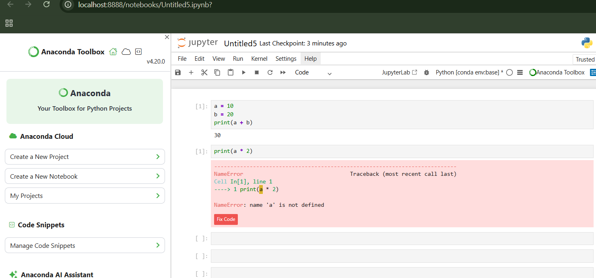

# Understanding the Data Science Lifecycle: Question → Data → Insight

## Explaining the Lifecycle

In data science, every project begins with a clear question. The question defines the problem we want to solve and helps guide the entire analysis process. Without a clear question, analyzing data may lead to meaningless results.

Once the question is defined, the next step is understanding the data. Data acts as evidence that helps answer the question. It is important to understand where the data comes from, what each column represents, and whether the data contains missing values, inconsistencies, or biases.

After understanding the data, we explore it using exploratory data analysis (EDA). This helps identify patterns, trends, and relationships in the data.

Finally, observations from the data are converted into insights. Insights help decision-makers understand the problem better and make informed decisions.

---

## Project Context: Medikit – Disease Pattern Analysis

### Question
Can data analysis help small community clinics identify seasonal disease outbreaks and common symptoms early?

### Data
The data may come from clinic records such as:
- Patient symptoms
- Visit dates
- Diagnosis
- Age group
- Location

This data represents patient health information collected over time.

### Insight
By analyzing the data, clinics may identify patterns such as certain diseases increasing during specific seasons or symptoms appearing frequently together. These insights can help doctors diagnose diseases earlier and plan treatments effectively.


## 4.6 

## Data Science Environment Setup

**Operating System:** Windows  
**Python Version:** Python 3.13.9  
**Conda Environment:** base  

### Installation
1. Installed Python and Anaconda using the Windows 64-bit installer from https://www.anaconda.com/download.
2. Opened Anaconda Prompt after installation.

### Verification

```bash
python --version
conda --version
conda env list

# Jupyter Notebook Setup

## Objective
To learn how to launch and use Jupyter Notebook and understand its interface.

## Tasks Done
- Launched Jupyter Notebook using Anaconda Prompt  
- Explored the Home interface  
- Navigated folders  
- Created and renamed a notebook  
- Ran a simple Python code  

## Code
```python
print("Hello Data Science!!")


# Code vs Markdown Cells

## Overview
This notebook demonstrates the difference between Code cells and Markdown cells in Jupyter Notebook.

## Key Points
- Code cells are used to run Python code
- Markdown cells are used to explain the code
- Proper structure improves readability

## File
- code-vs-markdown-demo.ipynb

## Conclusion
Using Code and Markdown separately makes notebooks clear and easy to understand.


# Jupyter Kernel Management

This project demonstrates how to manage Jupyter Notebook kernels effectively.  
It shows how running cells in order affects execution and variable usage.  
Kernel restart is used to reset the notebook state and clear variables.  
Interrupt functionality helps stop long-running or stuck executions safely.  
These practices ensure reproducibility and consistent notebook behavior.
